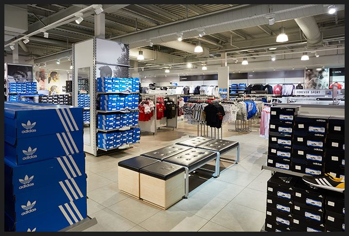
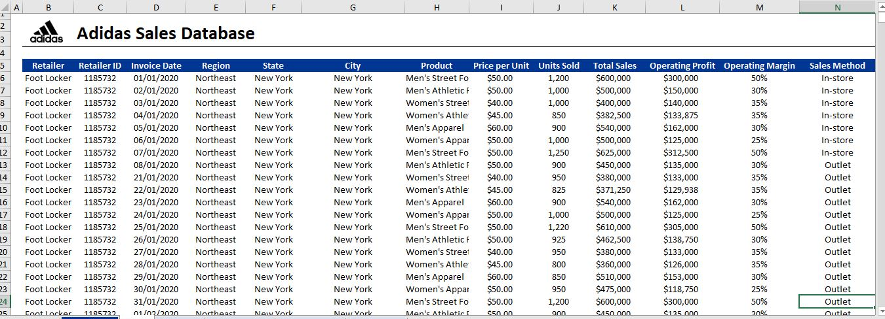
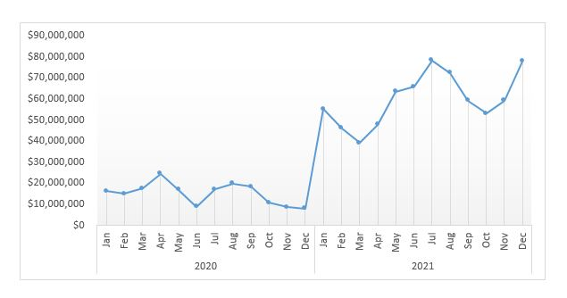
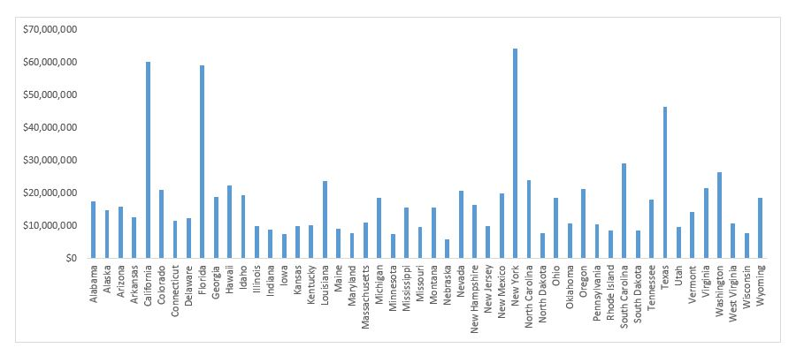
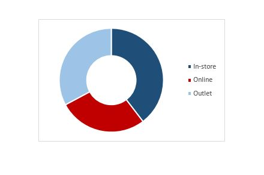
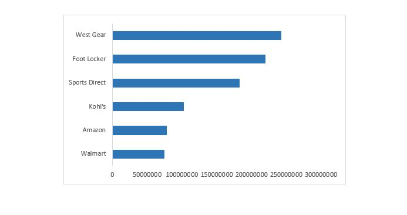
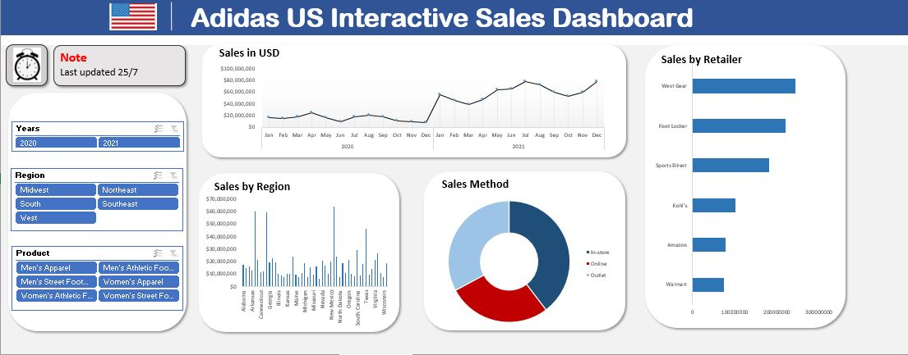

# Adidas Sales Analysis

## Introduction
Introduction
This is an excel project on sales analysis of imaginary store named **Adidas Store**. The project is to analyze and drive insights to answer crucial questions and help the store make data driven decisions.

**_Disclaimer_**: _All datasets and reports do not represent any company, institution or country. But just a dummy dataset to demonstrate capabilities of Microsoft Excel_.

## Brief overview of dataset
An excel file which contained the dataset. The dataset has 9653 rows and 13 columns. This is the [dataset](https://view.flodesk.com/pages/62e6c1afc4d48aec3664b8e4)

## Problem statement:
  1.	Which region has the highest sales?
  2.	What is the worth in $ of the total sales?
  3.	Which sales method has the highest sales?
  4.	Which of the retailers has the highest and lowest sales?
  5.	What is the sales by time period?

## Skills/ Concept Demostrated
The following Microsoft Excel skills were demonstrated:
  * Data cleaning
  * Pivot Table
  * Slicer
  * interactive Dashboard Creation.

## Data Cleaning
The dataset does not contain duplicate entry, no inaccuracy, and there is no inconsistency in the data. In other word the data is a clean data therefore there is no further cleaning.

## Sales Analysis
The dataset contains 9653 rows and 13 columns, there is no missing row or column.

## Total Sales in $
* The highest total sales in 2020 were observed in April, reaching $24,607,006, followed by August with $19,877,980.
* In 2021, the sales figures started strong in January with $55,225,396 and peaked in July at $78,334,681.
* Overall, the total sales for the period amounted to $899,902,125

## Sales by Region

Top Performing States: The highest total sales were observed in California with $60,174,133, followed by Florida with $59,283,714, and New York with $64,229,039.

Least Performing States: The least total sales were observed in Nebraska with $5,929,038, followed by Rhode Island with $8,446,806,
and Maine with $9,195,978

Southern States: Several states in the southern region, such as South Carolina, Texas, Louisiana, and North Carolina, demonstrate significant sales figures.

---
## Sales by Channel
- In-store Sales: The in-store channel generated the highest sales, totaling $356,643,750. This indicates that a significant portion of sales is derived from physical retail locations.

- Online Sales: The online channel contributed $247,672,882 to the total sales. This signifies the growing importance of e-commerce and the digital market.

- Outlet Sales: The outlet channel accounted for $295,585,493 in sales.

---
## Sales by Retailer
- Top Performing Retailers: Among the listed retailers, the top performers in terms of total sales are Foot Locker with $220,094,720, followed by West Gear with $242,964,333 and Sports Direct with $182,470,997.

- Walmart and Amazon: Two of the most well-known retail giants, Walmart and Amazon, also achieved significant sales figures, with Walmart at $74,558,410 and Amazon at $77,698,912.

## Sales Dashboard
The dashboard is an interactive dashboard. There are three (3) slicers namely:
  - Years: It can be used to filter the dashboard based on years.
  - Region: This interact with the dashboard based on region.
  - Product: It can be used to filter the dashboard based on product.

